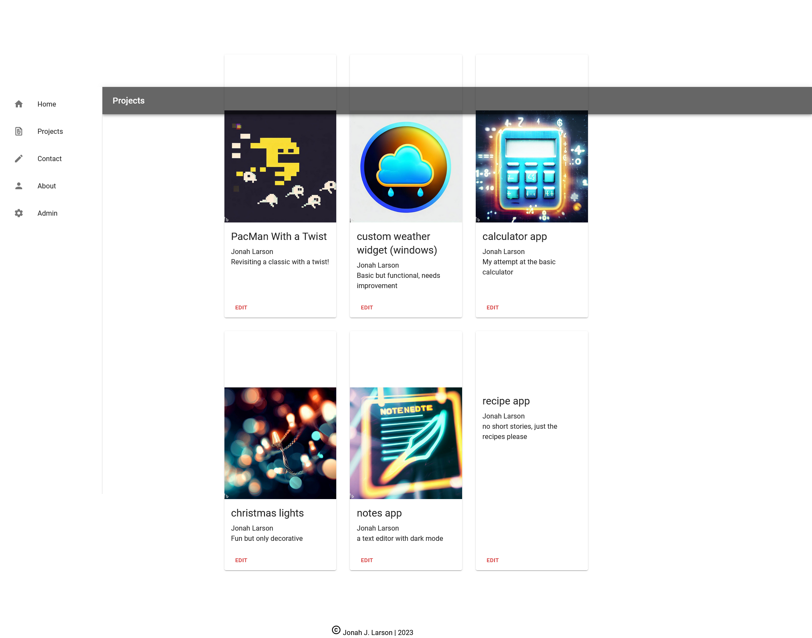
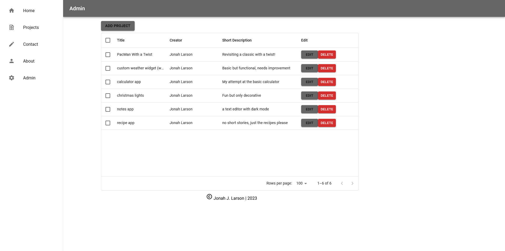

# react-final

This was a final project in a React class. The goal was to create a website using the React framework. 

- - - - 

- - - -

- - - -

## Requirements

[React_Final_Requirements.jpg](React_Final_Requirements.jpg "React_Final_Requirements.jpg")

- - - - 
## How to Install / Run

Open project folder with IDE of choice (recommendation: Visual Studio Code)
From within the react-final directory, type 'npm install' into bash (this should install all the dependencies required by the project)

You may need to open an extra bash window for the next part.

This project was bootstrapped with [Create React App](https://github.com/facebook/create-react-app). It also utilizes json-server.
In the project directory, you can run:

In one bash window, type the below command (from react-final directory) - 
### `npm start`

Runs the app in the development mode.
Open [http://localhost:3000](http://localhost:3000) to view it in your browser.
The page will reload when you make changes.

In the other bash window, type the below command (from react-final directory) -
### `json-server src/server/projects.json --port 3001`